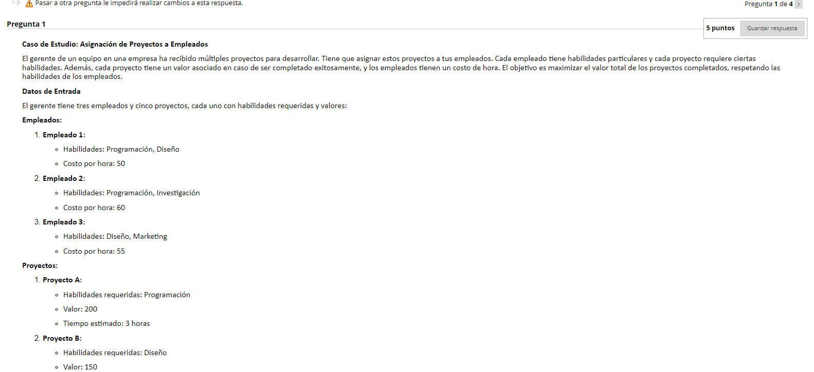
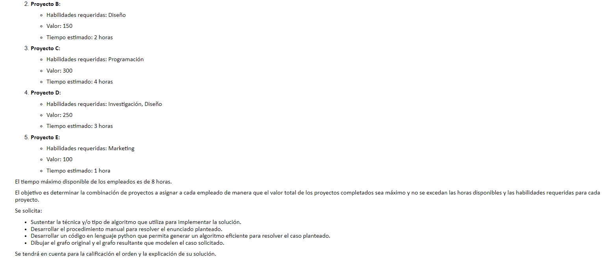
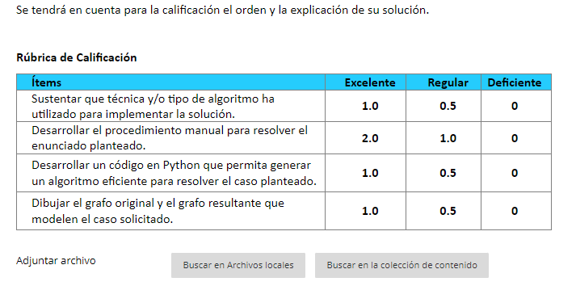

  

Caso de Estudio: Asignación de Proyectos a Empleados

El gerente de un equipo en una empresa ha recibido múltiples proyectos para desarrollar. Tiene que asignar estos proyectos a tus empleados. Cada empleado tiene habilidades particulares y cada proyecto requiere ciertas habilidades. Además, cada proyecto tiene un valor asociado en caso de ser completado exitosamente, y los empleados tienen un costo de hora. El objetivo es maximizar el valor total de los proyectos completados, respetando las habilidades de los empleados.

Datos de Entrada

El gerente tiene tres empleados y cinco proyectos, cada uno con habilidades requeridas y valores:

Empleados:

Empleado 1:
Habilidades: Programación, Diseño
Costo por hora: 50
Empleado 2:
Habilidades: Programación, Investigación
Costo por hora: 60
Empleado 3:
Habilidades: Diseño, Marketing
Costo por hora: 55
Proyectos:

Proyecto A:
Habilidades requeridas: Programación
Valor: 200
Tiempo estimado: 3 horas
Proyecto B:
Habilidades requeridas: Diseño
Valor: 150
Tiempo estimado: 2 horas
Proyecto C:
Habilidades requeridas: Programación
Valor: 300
Tiempo estimado: 4 horas
Proyecto D:
Habilidades requeridas: Investigación, Diseño
Valor: 250
Tiempo estimado: 3 horas
Proyecto E:
Habilidades requeridas: Marketing
Valor: 100
Tiempo estimado: 1 hora
El tiempo máximo disponible de los empleados es de 8 horas.

El objetivo es determinar la combinación de proyectos a asignar a cada empleado de manera que el valor total de los proyectos completados sea máximo y no se excedan las horas disponibles y las habilidades requeridas para cada proyecto.

Se solicita:

Sustentar la técnica y/o tipo de algoritmo que utiliza para implementar la solución.
Desarrollar el procedimiento manual para resolver el enunciado planteado.
Desarrollar un código en lenguaje python que permita generar un algoritmo eficiente para resolver el caso planteado.
Dibujar el grafo original y el grafo resultante que modelen el caso solicitado.
Se tendrá en cuenta para la calificación el orden y la explicación de su solución.

 