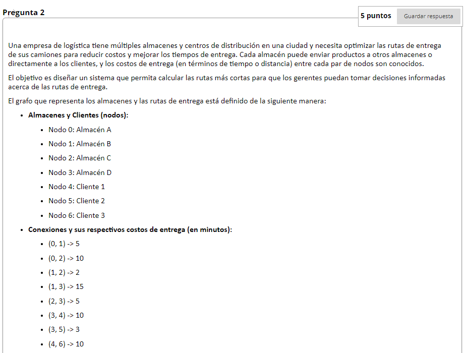
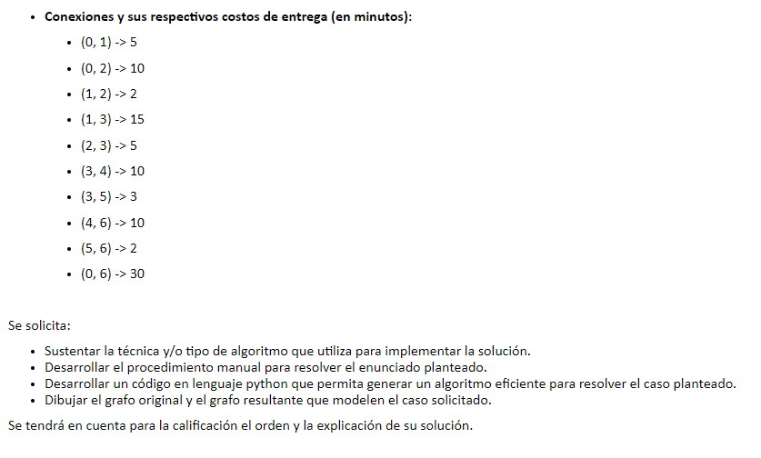
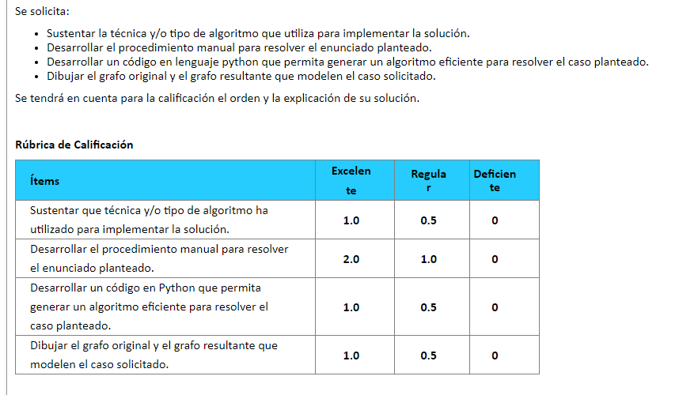

Una empresa de logística tiene múltiples almacenes y centros de distribución en una ciudad y necesita optimizar las rutas de entrega de sus camiones para reducir costos y mejorar los tiempos de entrega. Cada almacén puede enviar productos a otros almacenes o directamente a los clientes, y los costos de entrega (en términos de tiempo o distancia) entre cada par de nodos son conocidos.

El objetivo es diseñar un sistema que permita calcular las rutas más cortas para que los gerentes puedan tomar decisiones informadas acerca de las rutas de entrega.

El grafo que representa los almacenes y las rutas de entrega está definido de la siguiente manera:

Almacenes y Clientes (nodos):
Nodo 0: Almacén A
Nodo 1: Almacén B
Nodo 2: Almacén C
Nodo 3: Almacén D
Nodo 4: Cliente 1
Nodo 5: Cliente 2
Nodo 6: Cliente 3
Conexiones y sus respectivos costos de entrega (en minutos):
(0, 1) -> 5
(0, 2) -> 10
(1, 2) -> 2
(1, 3) -> 15
(2, 3) -> 5
(3, 4) -> 10
(3, 5) -> 3
(4, 6) -> 10
(5, 6) -> 2
(0, 6) -> 30
 

Se solicita:

Sustentar la técnica y/o tipo de algoritmo que utiliza para implementar la solución.
Desarrollar el procedimiento manual para resolver el enunciado planteado.
Desarrollar un código en lenguaje python que permita generar un algoritmo eficiente para resolver el caso planteado.
Dibujar el grafo original y el grafo resultante que modelen el caso solicitado.
Se tendrá en cuenta para la calificación el orden y la explicación de su solución.