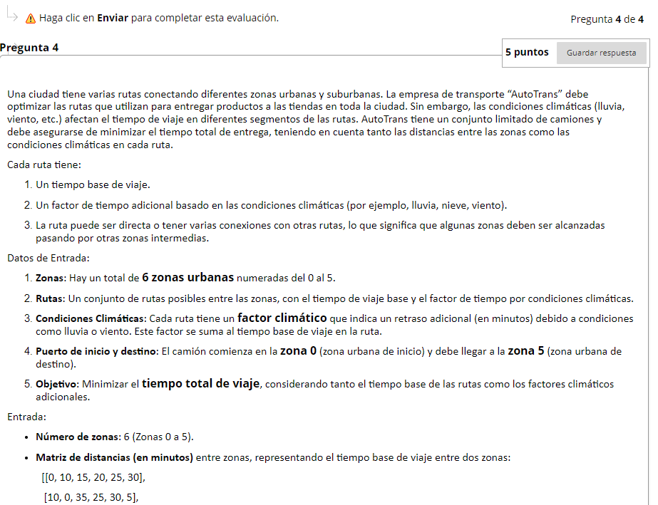
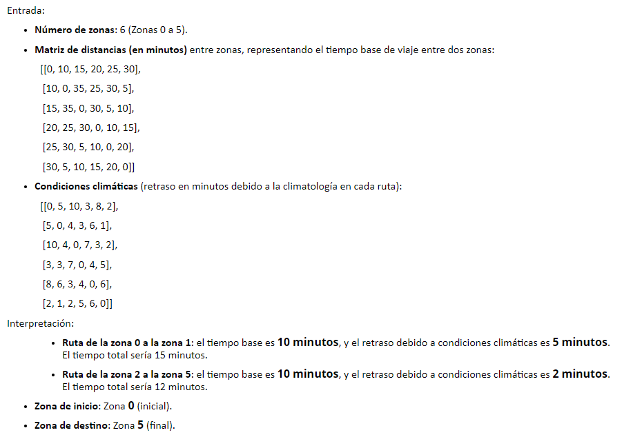
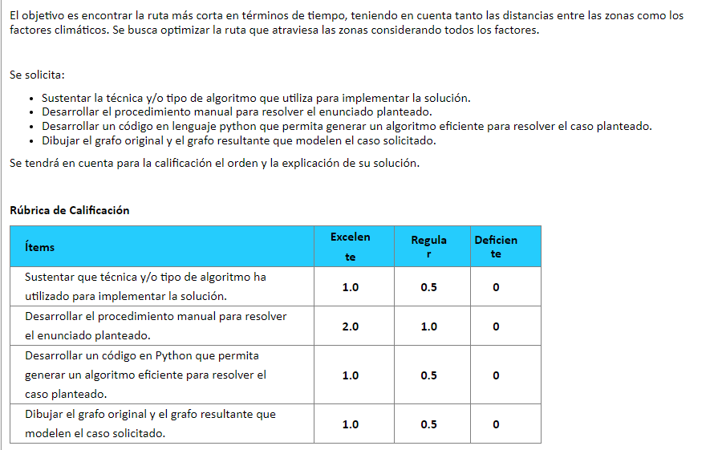

  

Una ciudad tiene varias rutas conectando diferentes zonas urbanas y suburbanas. La empresa de transporte “AutoTrans” debe optimizar las rutas que utilizan para entregar productos a las tiendas en toda la ciudad. Sin embargo, las condiciones climáticas (lluvia, viento, etc.) afectan el tiempo de viaje en diferentes segmentos de las rutas. AutoTrans tiene un conjunto limitado de camiones y debe asegurarse de minimizar el tiempo total de entrega, teniendo en cuenta tanto las distancias entre las zonas como las condiciones climáticas en cada ruta.

Cada ruta tiene:

Un tiempo base de viaje.
Un factor de tiempo adicional basado en las condiciones climáticas (por ejemplo, lluvia, nieve, viento).
La ruta puede ser directa o tener varias conexiones con otras rutas, lo que significa que algunas zonas deben ser alcanzadas pasando por otras zonas intermedias.
Datos de Entrada:

Zonas: Hay un total de 6 zonas urbanas numeradas del 0 al 5.
Rutas: Un conjunto de rutas posibles entre las zonas, con el tiempo de viaje base y el factor de tiempo por condiciones climáticas.
Condiciones Climáticas: Cada ruta tiene un factor climático que indica un retraso adicional (en minutos) debido a condiciones como lluvia o viento. Este factor se suma al tiempo base de viaje en la ruta.
Puerto de inicio y destino: El camión comienza en la zona 0 (zona urbana de inicio) y debe llegar a la zona 5 (zona urbana de destino).
Objetivo: Minimizar el tiempo total de viaje, considerando tanto el tiempo base de las rutas como los factores climáticos adicionales.
Entrada:

Número de zonas: 6 (Zonas 0 a 5).
Matriz de distancias (en minutos) entre zonas, representando el tiempo base de viaje entre dos zonas:
[[0, 10, 15, 20, 25, 30],

 [10, 0, 35, 25, 30, 5],

 [15, 35, 0, 30, 5, 10],

 [20, 25, 30, 0, 10, 15],

 [25, 30, 5, 10, 0, 20],

 [30, 5, 10, 15, 20, 0]]

Condiciones climáticas (retraso en minutos debido a la climatología en cada ruta):
[[0, 5, 10, 3, 8, 2],

 [5, 0, 4, 3, 6, 1],

 [10, 4, 0, 7, 3, 2],

 [3, 3, 7, 0, 4, 5],

 [8, 6, 3, 4, 0, 6],

 [2, 1, 2, 5, 6, 0]]

Interpretación:

Ruta de la zona 0 a la zona 1: el tiempo base es 10 minutos, y el retraso debido a condiciones climáticas es 5 minutos. El tiempo total sería 15 minutos.
Ruta de la zona 2 a la zona 5: el tiempo base es 10 minutos, y el retraso debido a condiciones climáticas es 2 minutos. El tiempo total sería 12 minutos.
Zona de inicio: Zona 0 (inicial).
Zona de destino: Zona 5 (final).
 

El objetivo es encontrar la ruta más corta en términos de tiempo, teniendo en cuenta tanto las distancias entre las zonas como los factores climáticos. Se busca optimizar la ruta que atraviesa las zonas considerando todos los factores.

 

Se solicita:

Sustentar la técnica y/o tipo de algoritmo que utiliza para implementar la solución.
Desarrollar el procedimiento manual para resolver el enunciado planteado.
Desarrollar un código en lenguaje python que permita generar un algoritmo eficiente para resolver el caso planteado.
Dibujar el grafo original y el grafo resultante que modelen el caso solicitado.
Se tendrá en cuenta para la calificación el orden y la explicación de su solución.

 