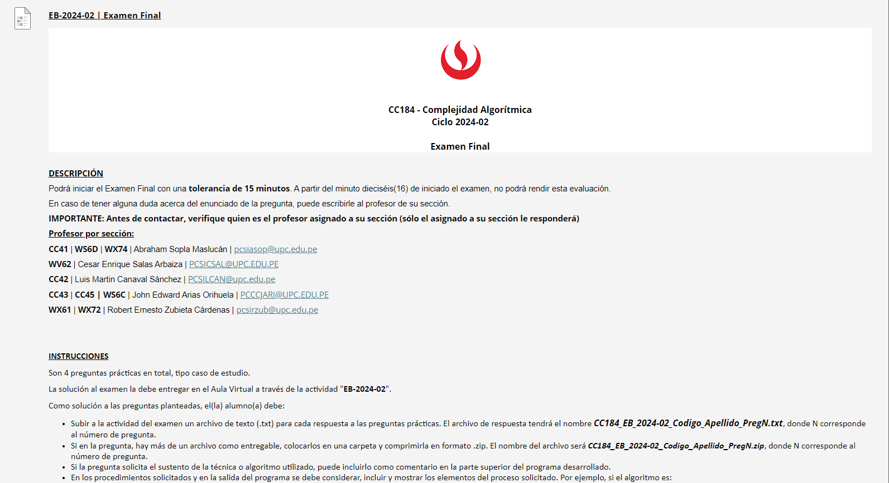
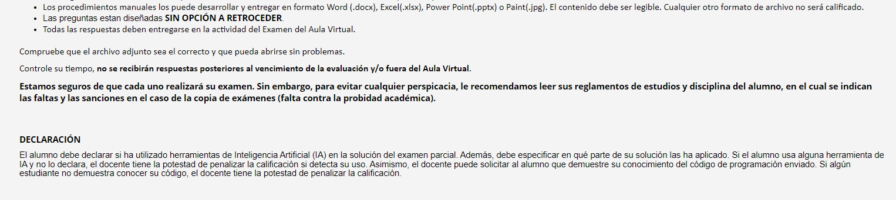

DESCRIPCIÓN
Podrá iniciar el Examen Final con una tolerancia de 15 minutos. A partir del minuto dieciséis(16) de iniciado el examen, no podrá rendir esta evaluación.
En caso de tener alguna duda acerca del enunciado de la pregunta, puede escribirle al profesor de su sección.
IMPORTANTE: Antes de contactar, verifique quien es el profesor asignado a su sección (sólo el asignado a su sección le responderá)  
Profesor por sección:       
CC41 | WS6D | WX74 | Abraham Sopla Maslucán | pcsiasop@upc.edu.pe  
WV62 | Cesar Enrique Salas Arbaiza | PCSICSAL@UPC.EDU.PE  
CC42 | Luis Martin Canaval Sánchez | PCSILCAN@upc.edu.pe  
CC43 | CC45 | WS6C | John Edward Arias Orihuela | PCCCJARI@UPC.EDU.PE  
WX61 | WX72 | Robert Ernesto Zubieta Cárdenas | pcsirzub@upc.edu.pe  
 
 
INSTRUCCIONES
Son 4 preguntas prácticas en total, tipo caso de estudio.
La solución al examen la debe entregar en el Aula Virtual a través de la actividad "EB-2024-02".
Como solución a las preguntas planteadas, el(la) alumno(a) debe:
Subir a la actividad del examen un archivo de texto (.txt) para cada respuesta a las preguntas prácticas. El archivo de respuesta tendrá el nombre CC184_EB_2024-02_Codigo_Apellido_PregN.txt, donde N corresponde al número de pregunta.
Si en la pregunta, hay más de un archivo como entregable, colocarlos en una carpeta y comprimirla en formato .zip. El nombre del archivo será CC184_EB_2024-02_Codigo_Apellido_PregN.zip, donde N corresponde al número de pregunta.
Si la pregunta solicita el sustento de la técnica o algoritmo utilizado, puede incluirlo como comentario en la parte superior del programa desarrollado.
En los procedimientos solicitados y en la salida del programa se debe considerar, incluir y mostrar los elementos del proceso solicitado. Por ejemplo, si el algoritmo es:
Fuerza Bruta o Backtracking, se debe considerar los espacios de búsqueda.
Dijkstra, UCS, A* o recorridos, se debe considerar los caminos y pesos.
UFDS o SCC o Divide y Vencerás, se debe considerar sus operaciones principales.
MST, se debe considerar cada arista con sus pesos y la forma de obtener el costo total.
Flujo Máximo de Redes, se debe considerar caminos de aumento y sus flujos y el flujo total.
Programación Dinámica o Greedy, se debe considerar las estructuras, estructura de tabla y el enfoque usado.
Los procedimientos manuales los puede desarrollar y entregar en formato Word (.docx), Excel(.xlsx), Power Point(.pptx) o Paint(.jpg). El contenido debe ser legible. Cualquier otro formato de archivo no será calificado.
Las preguntas estan diseñadas SIN OPCIÓN A RETROCEDER.
Todas las respuestas deben entregarse en la actividad del Examen del Aula Virtual.
 
Compruebe que el archivo adjunto sea el correcto y que pueda abrirse sin problemas.
Controle su tiempo, no se recibirán respuestas posteriores al vencimiento de la evaluación y/o fuera del Aula Virtual.
Estamos seguros de que cada uno realizará su examen. Sin embargo, para evitar cualquier perspicacia, le recomendamos leer sus reglamentos de estudios y disciplina del alumno, en el cual se indican las faltas y las sanciones en el caso de la copia de exámenes (falta contra la probidad académica).
 
 
DECLARACIÓN
El alumno debe declarar si ha utilizado herramientas de Inteligencia Artificial (IA) en la solución del examen parcial. Además, debe especificar en qué parte de su solución las ha aplicado. Si el alumno usa alguna herramienta de IA y no lo declara, el docente tiene la potestad de penalizar la calificación si detecta su uso. Asimismo, el docente puede solicitar al alumno que demuestre su conocimiento del código de programación enviado. Si algún estudiante no demuestra conocer su código, el docente tiene la potestad de penalizar la calificación.
 
